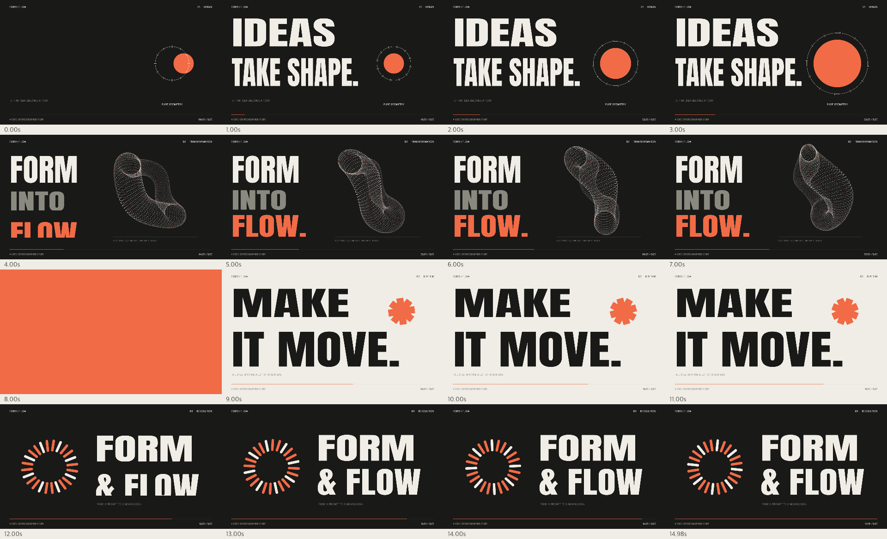

# Prompt Motion Lab

**Turn an idea into a checkable, reproducible, editable code-rendered film.**

[中文](README.md) · [Live lab](https://nonggde.github.io/prompt-motion-lab/) · [Install the AI skill](#teach-an-ai-to-make-videos) · [English workflow](docs/workflow.en.md)

Prompt Motion Lab is our bilingual code-video laboratory. It joins brief discovery, visual direction, original prompts, timed storyboards, code scenes, synchronized sound, and verification in one reproducible workflow. It does not require a particular model, and it does not present a web template as a cloud video-generation service.



## What is here

- **96 original bilingual recipes**: 24 per direction, with product flows, data and algorithms, 3D structures, and playable automated demos. Includes multiword search, technology filters, full-contract copying and JSON download. New recipes await experiments; see the [recipe contract](docs/recipes.md).
- **Runnable scenes** for FORM & FLOW, Token Bucket, and PULSE / GRID. The same time-driven scene can be previewed, storyboarded, and exported.
- **An AI production skill** that turns a natural-language brief into direction options, bilingual prompts, a timed storyboard, a code plan, a sample, and verification evidence.
- **Experiment feedback** that records inputs, versions, render settings, observations, and next steps instead of labeling untested ideas as finished work.
- **Bilingual documentation** across the interface, recipes, skill, contribution rules, and workflow guides.

## Quick start

Open the [live lab](https://nonggde.github.io/prompt-motion-lab/) without installing anything. For local work, use Node.js 20+:

```sh
git clone https://github.com/nonggde/prompt-motion-lab.git
cd prompt-motion-lab
npm ci
npm start
```

Open `http://127.0.0.1:4173`. `npm run build` creates an offline `dist/index.html`; keep exported films beside the `media/` directory.

## Teach an AI to make videos

Install [skills/prompt-to-video/SKILL.md](skills/prompt-to-video/SKILL.md) in an AI tool that supports Skills:

```text
Use prompt-to-video to turn my goal, audience, assets, and duration into a bilingual prompt and timed storyboard.
Offer executable visual directions first, then make a code-rendered sample, inspect the actual frames and video metadata, and deliver source, MP4, preview, and an experiment record.
```

Compatible installers can also use:

```sh
npx skills add nonggde/prompt-motion-lab --skill prompt-to-video
```

The skill selects tools and assets within the user's authorization. It does not publish, contact people, purchase services, or claim that a model has been tested when it has not. A work enters `validated` only after an actual render and inspection.

## Render and verify

```sh
npm test
npm run render -- --mode reel --stills-only
npm run render -- --mode reel
npm run render -- --mode bucket
npm run render -- --scene examples/pulse-grid.cjs --output media/pulse-grid.mp4
npm run check:media
npm run build
```

A custom scene exports `duration`, even `width`/`height`, and `render(ctx, t, config)`. Each frame is computed from time and fixed configuration; add `audio(sampleRate)` when the scene needs its own sound. Inspect the storyboard before rendering the full film. The current renderer supports `--duration`, `--fps`, `--output`, and `--stills-only`; see the [render contract](skills/prompt-to-video/references/render-contract.md).

## Project layout

```text
src/                    preview, time-driven animation, synthesized sound, PULSE scene
data/prompts.json       Prompt Motion Lab's original bilingual recipes
examples/               independently renderable scene entry points
media/                  MP4 films and storyboards made by this project
scripts/                serving, building, rendering, and checks
skills/prompt-to-video/ installable AI production skill
docs/                   bilingual workflow and experiment records
```

## License and contributions

Code, original recipes, original scenes, and project-made media use [MIT](LICENSE). The font's separate license is recorded in [THIRD_PARTY_NOTICES.md](THIRD_PARTY_NOTICES.md).

Contribute original recipes, runnable scenes, storyboards, and experiment records. Provide Chinese and English, plus the actual command, output settings, observations, and remaining limitations. See [CONTRIBUTING.md](CONTRIBUTING.md).
